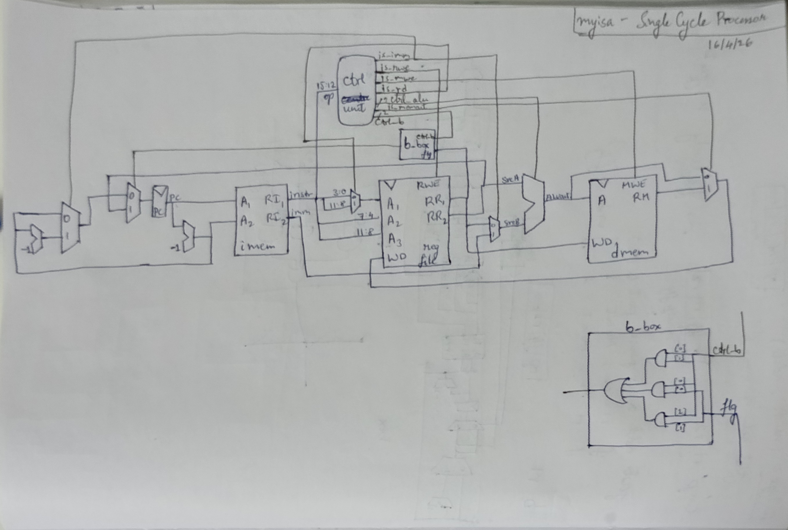

# `myisa` SystemVerilog Implementation

> Who is this written for?
>
> A person with basic knowledge in Computer Architecture, digital design, SystemVerilog, and the C programming language.
>
> This is sort of the next part of the previous blog.

Moving forward from a high level language like `C`, the next rational step would be to design a
single cycle implementation for `myisa`, which is exactly what I did.

## Single Cycle `myisa` Design

Here is what I designed, very roughly, on paper.

This diagram closely resembles a MIPS single cycle processor in Harris and Harris' [Digital Design and Computer Architecture](https://unidel.edu.ng/focelibrary/books/Digital%20Design%20and%20Computer%20Architecture%20(Harris,%20Sarah,%20Harris,%20David)%20(Z-Library).pdf). 
Since I have separate instruction and data memories, this would technically be of Harvard Architecture, which is not according to `myisa`, but
I later change this to a unified memory in my pipeline, making it Von Neumann.
I have changed a bunch of data wire and control signal names, because I feel those would be of better naming choice(to each their own, I guess).
Following this nomenclature, I choose to prefix all control signals with `is_`, which generally implies a binary signal of true/false.
For control signals that are vectors, they are prefixed with `ctrl_` to indicate that it is a control signal.
In my opinion, I feel this would make each wire and its purpose a lot clearer than what it was in Harris and Harris.
Some other short forms/wire names that I've used are as follows:

- PC: Program Counter
- imem: Instruction Memory
- regfile: Register File
- dmem: Data Memory
- instr: instruction
- imm: immediate
- Ai: Inputs to blocks
- RI: Read Instruction
- RR: Read Register
- RM: Read Memory
- WD: Write Data
- RWE: Register Write Enable
- MWE: Memory Write Enable
- SrcA, SrcB: Inputs to the ALU
- ALUout: output of ALU
- b_box: A small block containing some logic for considering when to branch.
- is_b, ctrl_b: Branch related signals
- is_memout: Is memory outputted(to control choice between aluout and rm).
- is_rd: Is Register Destination the first operand or the last operand(quirks of my ISA).
- is_mwe, is_rwe: Are we supposed to write to memory or register file respectively
- is_imm: Does the current instruction need an immediate value? Used to choose next PC and to choose SrcB.
- ctrl_b: Control vector for deciding whether to branch or not
- ctrl_alu: The control value for the ALU

Some changes are there for the input to the PC register. Due to the quirks of myisa, if the instruction is an
immediate type, then the PC has to be subtracted twice, which is what one subtractor and one multiplexer is doing.
We also have the mux for branching. The PC(and PC-1) are fed into the `imem` - Instruction Memory block. Which always
returns both the intruction at PC, and whatever is in the next line. Depending on whether the instruction is of an
immediate type, we choose to use it.

From the `imem`, the instruction (and the immediate) move on to the register file(`regfile`).
It is the classic regfile from Harris and Harris. The opcode of the instruction is sent to the control unit, which
gives out a bunch of control signals(all on black). Note that the control unit and the `imem` is purely combinatorial.
The regfile outputs `rr1` and `rr2`, which are sent to SrcB(sometimes), WD and the b_box AND back to the PC and SrcA respectively.

The ALU does the necessary computations depending on `ctrl_alu`, to give aluout.
This moves on the `dmem`, which gives rm, and we have a final mux to select between aluout and rm, to send back to the WD of regfile.

## Single Cycle implementation in SystemVerilog

Most of the modules are taken from Harris and Harris' book, with some modifications as per `myisa`.
The ALU is similar, but I've removed all other operations other than what I have. I've also not implemented
multiplication or division, since that is generally not directly synthesizable. I want to implement it later,
perhaps in a pipeline.

The Control Unit is similar, but with my wire names, and my choice of opcodes.
The Data Memory, Instruction Memory and RegFile are more or less the same.
I made a file for `tools`. Basically D Flip flops, muxers, the single subtraction I needed for the PC and the b_box.

The top level module is basically everything you see in the diagram put exactly as is into SystemVerilog code.

Refer the code [here](https://github.com/kajuburfi/myisa/tree/master/single_cycle).

This is quite straightforward as it is, so here we move on to the pipelined version.

## Pipelined implementation in SystemVerilog

I hadn't implemented any pipelined processor before. Hence, this was a new challenge.
My initial thought was to just sketch out the pipelined processor, i.e. just put a bunch of pipeline
registers between the necessary stages(which I get to decide, of course), and write out the verilog
code for that. So... That's what I did. Here's the sketch:

So, I made a file, `pipeline_regs.sv`, and filled it with D flip flops that do exactly what is shown here.
It's a very lengthy, but simple process.

Now, if we run the processor and open the dump file with gtkwave, we see the pipeline working as it should.
But, we have a bunch of hazards that need some fixing. Hence, we get the next iteration, Pipeline with Forwarding:

This adds a _Hazard Unit_ at the bottom, which encompasses all stages. I pull the necessary wires from each stage,
and add the muxers required to accomplish the forwarding. And, this more or less works. Next, we need stalls(in the
case of `lw` - load word, which requires an extra cycle for fetching):

Here, we add another mux, pull a couple more wires, and add Enable and Synchronous Reset terminals to the pipeline registers.
This now allows us to control stalling(and one flush required along with that).

So far so good. Up till now, I had been more or less following _Harris and Harris_'s book, and used very similar logic.
But, for the control hazard case, it was just not working! I tried again and again and again. I ended up spending over a week
just on this; trying out different combinations, different cases, working out the logic behind each specific case, etc. 
At one point, I was able to get one specific `.asm` program working(that specific set and order of instructions), but another
would fail, and when I fixed that one, the previous one would stop working. It was annoying, but I finally managed to get the
whole thing put together. And here we have our final _(?)_ processor:

## Final Thoughts

As a whole, doing this has totally opened my view on computer architecture, and how processors actually work.
The way we learn from reading books has little to do with actually implementing, even if as a simulation, a processor.
Honestly, I feel like making up my own ISA made it simpler for me to design this, since I could make any architectural
choice I wanted, with the only downside being that it would come back to bite me later.
The joy of seeing your own little machine(_simulation_) actually give workable results is amazing!

The fact that humans are able to accomplish so much, literally to the point of making sand _think_, is mind blowing
without a doubt. And we are able to make a bunch of atoms do such complicated stuff for us, And that we are able to
get it down to such small sizes - transistors are about a few atoms wide today... Modern Engineering is truly magical.

